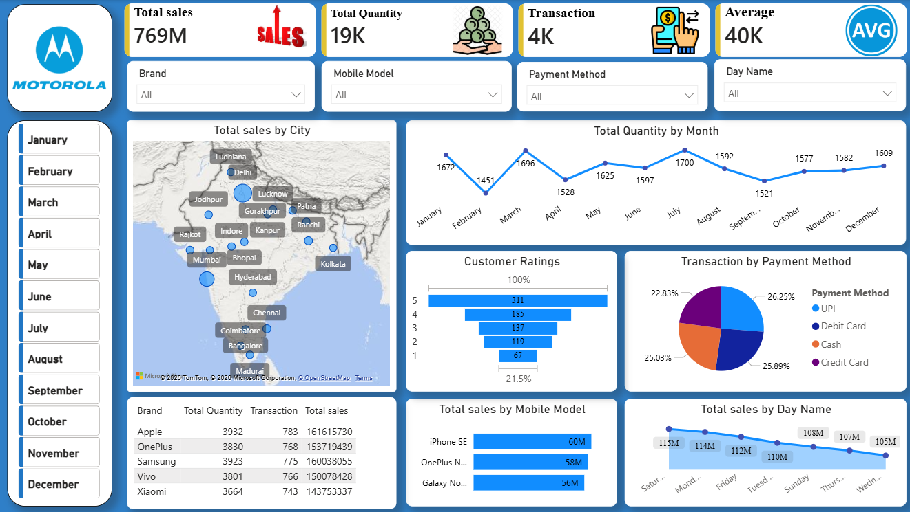

# Motorola Sales Dashboard 📊

An interactive **Power BI Dashboard** built to analyze mobile sales performance, customer behavior, payment trends, and regional sales distribution.

This project helps businesses make data-driven decisions through clear and interactive visualizations.

---

# 📊 Project Overview

The goal of this project is to convert raw sales data into meaningful insights using Power BI.

The dashboard helps users:
- Track sales performance
- Analyze customer purchasing behavior
- Compare mobile model sales
- Monitor payment trends
- Understand city-wise sales distribution

---

# ❓ Problem Statement

Businesses generate huge amounts of sales data daily, but understanding raw data can be difficult.

This project solves that problem by creating an interactive dashboard that answers important business questions like:

- Which mobile models generate the highest sales?
- Which cities contribute the most revenue?
- What payment methods are most preferred?
- Which days and months perform best in sales?
- How satisfied are customers based on ratings?

The dashboard enables better business decisions through visual analytics.

---

# 📂 Dataset Information

## Source
Raw Dataset collected from **Kaggle**-[Download Dataset](https://github.com/pranavrase/Motorola-Sales_Dashboard/blob/main/Motorola%20Raw%20Data.xlsx).

The dataset contains mobile sales transaction records used to analyze sales performance, customer behavior, and payment trends.

### Raw Dataset Columns

| Column Name | Description |
|-------------|-------------|
| Transaction ID | Unique ID for each transaction |
| Day | Day of purchase |
| Month | Month of purchase |
| Year | Year of purchase |
| Day Name | Name of the weekday |
| Brand | Mobile brand name |
| Units Sold | Number of units sold |
| Price Per Unit | Price of each mobile unit |
| Customer Name | Name of the customer |
| Customer Age | Age of the customer |
| City | Customer city/location |
| Payment Method | Payment type used for transaction |
| Customer Ratings | Customer feedback rating |
| Mobile Model | Name of the mobile model |

### Dataset Purpose

This dataset is used to:
- Analyze mobile sales trends
- Track customer purchasing behavior
- Compare brand and model performance
- Study payment preferences
- Identify city-wise sales distribution
- Understand customer satisfaction through ratings


---

# ⚙️ Tech Stack

<p align="left">
  
  
  
  
  
  
</p>


- **Power BI** → Dashboard creation and data visualization  
- **Power Query** → Data cleaning and transformation  
- **DAX (Data Analysis Expressions)** → Calculated measures and KPIs  
- **Microsoft Excel** → Dataset handling and preprocessing  
- **Kaggle Dataset** → Data source

---

# 📈 Dashboard Features

## KPI Cards
- Total Sales
- Total Quantity
- Total Transactions
- Average Sales

## Interactive Filters
- Brand Filter
- Mobile Model Filter
- Payment Method Filter
- Day Filter
- Month Selection

## Visualizations
- City-wise Sales Map
- Monthly Sales Trend
- Customer Ratings Analysis
- Payment Method Distribution
- Mobile Model Sales Comparison
- Day-wise Sales Analysis

---


# 📸 Dashboard Screenshot

## Main Dashboard



---

# 🔍 Key Insight
- Total sales reached 769M with 19K units sold.
- Around 4K transactions were completed overall.
- July had the highest sales quantity, while September had the lowest.
- iPhone SE was the top-selling mobile model.
- UPI was the most preferred payment method.
- Most customers gave 5-star ratings, showing high satisfaction.
- Saturday recorded the highest sales among weekdays.
- Major cities like Mumbai, Delhi, and Hyderabad contributed the most sales.
- Brand performance was competitive across all major smartphone brands.

---

# 💡 Business Recommendations

## Increase Inventory for Top Products
Maintain sufficient stock for high-selling mobile models to avoid missed sales opportunities.

## Improve Digital Payment Experience
Since most customers prefer online payments:
- Offer cashback rewards
- Improve payment security
- Simplify checkout process

## Focus on High-Performing Cities
Run targeted marketing campaigns in cities generating the highest revenue.

## Boost Sales on Low-Performing Days
Introduce:
- Weekend discounts
- Flash sales
- Limited-time offers

## Improve Customer Retention
Use customer feedback and ratings to:
- Improve services
- Build loyalty programs
- Encourage repeat purchases

---

# 📁 Project Structure

```bash
Motorola-Sales-Dashboard/
│
├──Dataset/
│   └── Motorola Raw Data.xlsx
├── Screenshots/
│   └── feb-sales.png
├── Motorola-Sales.pbix
└──  README.md


